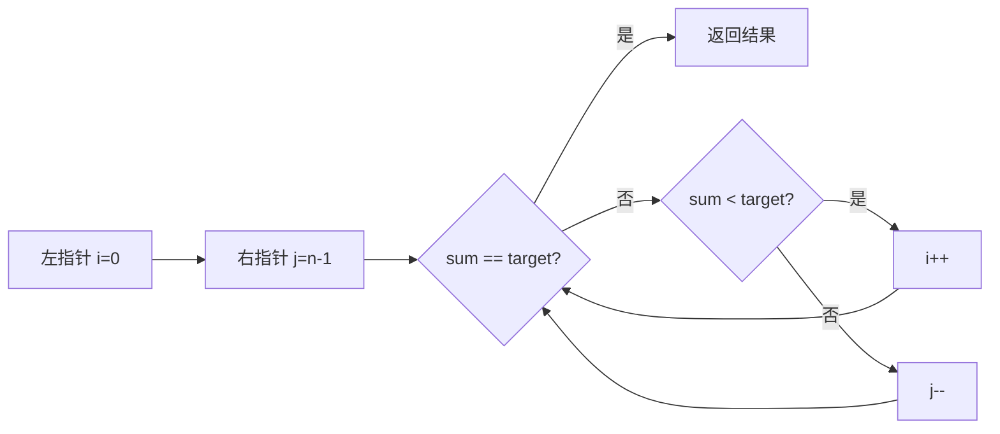
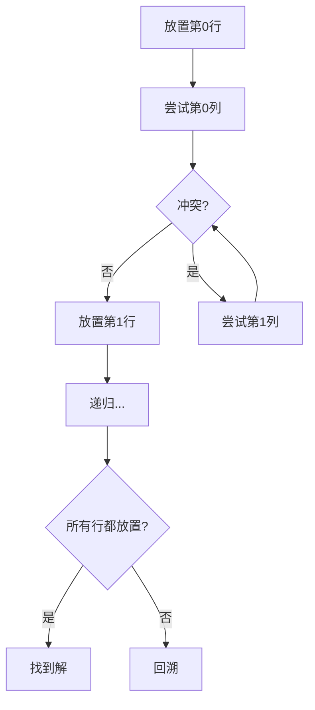

# 算法可视化功能实现方案

## 概述

在 planner 环节添加算法可视化功能，使用 Mermaid 生成算法流程图、数据结构图等，让用户更直观地理解算法思路。

## 功能设计

### 1. 可视化内容

#### A. 算法流程图
- 展示算法的主要步骤和决策分支
- 适用于：动态规划、贪心、回溯等

#### B. 数据结构示意图
- 展示数组、树、图等数据结构的变化
- 适用于：树遍历、图搜索等

#### C. 状态转移图
- 展示动态规划的状态转移关系
- 适用于：DP 问题

#### D. 递归调用树
- 展示递归算法的调用关系
- 适用于：回溯、分治等

### 2. 技术方案

#### 使用 Mermaid 语法

**优点**：
- LLM 容易生成
- 纯文本格式，易于存储和传输
- 广泛支持（GitHub、VSCode、在线工具）
- 无需额外依赖

**示例**：

```mermaid
graph TD
    A[开始: i=0, j=n-1] --> B{nums[i] + nums[j] == target?}
    B -->|是| C[返回 i, j]
    B -->|否| D{nums[i] + nums[j] < target?}
    D -->|是| E[i++]
    D -->|否| F[j--]
    E --> B
    F --> B
```

### 3. 实现架构

#### 修改文件

1. **app/state.py**
   - 在 `StrategyPlanState` 添加 `visualization` 字段

2. **app/prompts/planner.py**
   - 更新提示词，要求生成 Mermaid 图表

3. **app/agents/planner.py**
   - 解析 visualization 字段

4. **app/agents/formatter.py**
   - 在输出中包含可视化图表

5. **app/services/mermaid.py**（新增）
   - 提供 Mermaid 渲染功能（可选）

#### 状态模型扩展

```python
class StrategyPlan(BaseModel):
    explanation: str
    strategy_name: str
    time_complexity: str
    space_complexity: str
    key_steps: list[str]
    visualization: str = ""  # 新增：Mermaid 图表代码
    visualization_type: str = ""  # 新增：图表类型（flowchart/tree/graph）
```

#### Prompt 更新

```python
PLANNER_PROMPT = """
...

可视化要求：
- 如果算法适合用图表展示，生成 Mermaid 格式的可视化代码
- 可视化类型：
  1. flowchart - 算法流程图（适用于大多数算法）
  2. tree - 树形结构（适用于递归、回溯）
  3. graph - 图结构（适用于图算法、状态转移）
- 图表应该简洁清晰，突出关键步骤

输出 JSON 字段：
{
  "explanation": str,
  "strategy_name": str,
  "time_complexity": str,
  "space_complexity": str,
  "key_steps": [str],
  "visualization": str,  // Mermaid 代码，如果不适合可视化则为空
  "visualization_type": str  // "flowchart" | "tree" | "graph" | ""
}
"""
```

#### Formatter 输出

```python
# 在 formatter.py 中
if strategy.get("visualization"):
    viz_type = strategy.get("visualization_type", "flowchart")
    viz_code = strategy.get("visualization", "")
    
    if mode == "contest":
        parts.append(f"算法流程可视化：\n```mermaid\n{viz_code}\n```")
    else:
        parts.append(f"我画了个图帮你理解这个算法：\n```mermaid\n{viz_code}\n```")
```

### 4. 用户体验

#### 终端输出
```
算法选择：双指针法

算法流程可视化：


复杂度分析：时间复杂度：O(n)，空间复杂度：O(1)。
```

#### 渲染选项

**选项 1：纯文本显示**（默认）
- 直接在终端显示 Mermaid 代码
- 用户可以复制到支持 Mermaid 的工具中查看

**选项 2：自动渲染**（可选）
- 使用 `mermaid-cli` 或在线 API 渲染成图片
- 在终端显示图片（支持的终端）或保存到文件

**选项 3：Web 预览**（可选）
- 启动本地 Web 服务器
- 在浏览器中实时预览图表

### 5. 实现示例

#### 不同算法的可视化

**动态规划 - 背包问题**
```mermaid
graph TD
    A[dp[i][j] = 背包容量j时前i个物品的最大价值] --> B{是否选择第i个物品?}
    B -->|不选| C[dp[i][j] = dp[i-1][j]]
    B -->|选| D[dp[i][j] = dp[i-1][j-w[i]] + v[i]]
    C --> E[取最大值]
    D --> E
```

**回溯 - N皇后**


**二分查找**
```mermaid
graph TD
    A[left=0, right=n-1] --> B[mid = left+right/2]
    B --> C{nums[mid] == target?}
    C -->|是| D[返回 mid]
    C -->|否| E{nums[mid] < target?}
    E -->|是| F[left = mid+1]
    E -->|否| G[right = mid-1]
    F --> H{left <= right?}
    G --> H
    H -->|是| B
    H -->|否| I[返回 -1]
```

### 6. 扩展功能

#### A. 动画演示（未来）
- 生成逐步执行的动画
- 展示算法的每一步变化

#### B. 交互式图表（未来）
- 用户可以点击节点查看详细信息
- 可以调整参数观察算法变化

#### C. 多种可视化风格
- 简洁模式：只显示关键步骤
- 详细模式：显示所有细节
- 对比模式：对比多种算法

### 7. 配置选项

在 `.env` 中添加：

```env
# 可视化配置
ENABLE_VISUALIZATION=true
VISUALIZATION_FORMAT=mermaid  # mermaid | ascii | none
VISUALIZATION_RENDER=false    # 是否自动渲染成图片
VISUALIZATION_SAVE_PATH=./visualizations  # 图片保存路径
```

### 8. 实现优先级

#### Phase 1（核心功能）
- ✅ 在 planner 生成 Mermaid 代码
- ✅ 在 formatter 输出 Mermaid 代码块
- ✅ 支持流程图、树形图

#### Phase 2（增强功能）
- ⬜ 支持更多图表类型
- ⬜ 添加 ASCII Art 备选方案
- ⬜ 优化不同算法的可视化模板

#### Phase 3（高级功能）
- ⬜ 自动渲染成图片
- ⬜ Web 预览界面
- ⬜ 动画演示

## 其他特色功能建议

### 1. 测试用例生成器
```python
# 添加 test_generator 节点
- 根据题意自动生成测试用例
- 包括边界情况、极端情况
- 生成预期输出
```

### 2. 代码执行追踪
```python
# 增强 code_runner
- 记录代码执行过程
- 展示变量变化
- 帮助理解算法执行
```

### 3. 算法对比分析
```python
# 添加 comparator 节点
- 对比多种算法方案
- 生成对比表格
- 分析优缺点
```

### 4. 相似题目推荐
```python
# 添加 recommender 节点
- 推荐相似 LeetCode 题目
- 提供学习路径
- 难度递进
```

### 5. 错误诊断助手
```python
# 增强 verifier
- 详细的错误诊断
- 常见错误模式识别
- 修复建议
```

## 总结

**推荐优先实现**：Mermaid 可视化功能

**理由**：
1. 易于实现（LLM 可以直接生成）
2. 用户价值高（直观理解算法）
3. 无需额外依赖
4. 与现有架构兼容
5. 可以逐步扩展

**实现成本**：低
**用户价值**：高
**技术风险**：低

这将是一个很好的差异化功能，让你的系统比传统 LLM 更有价值！
